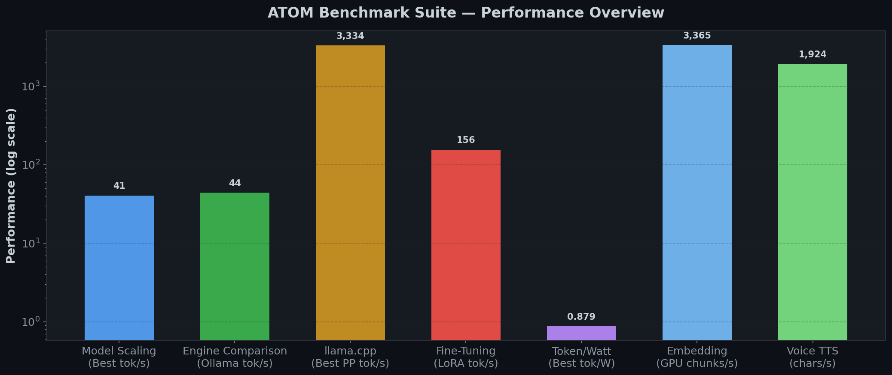
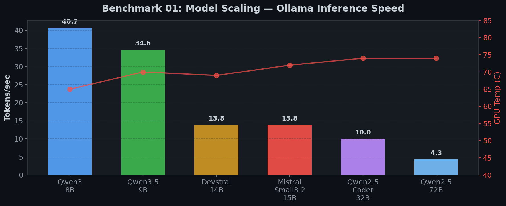
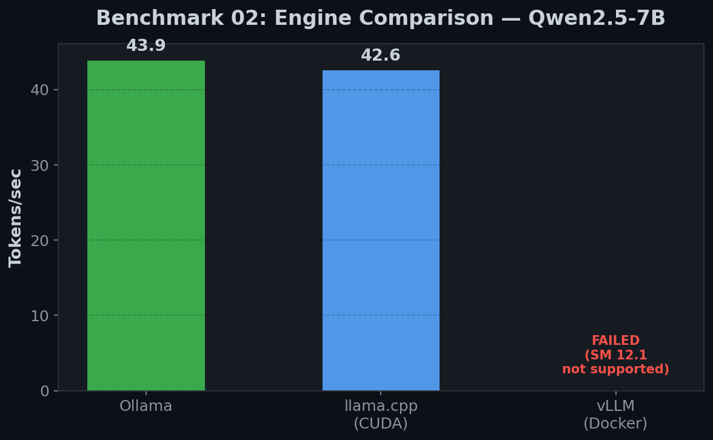
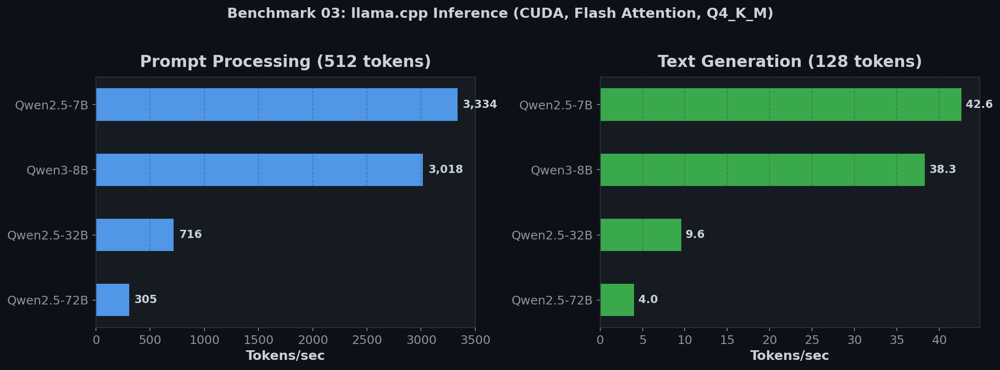
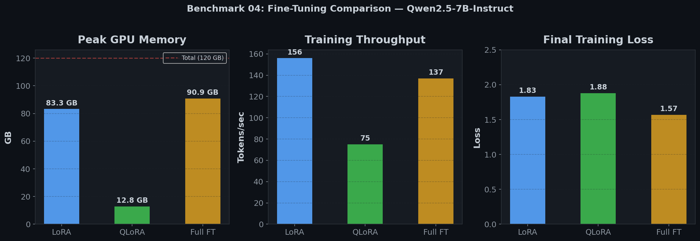
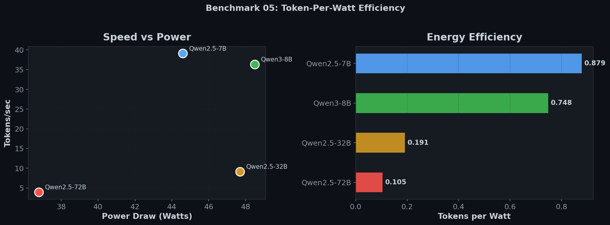
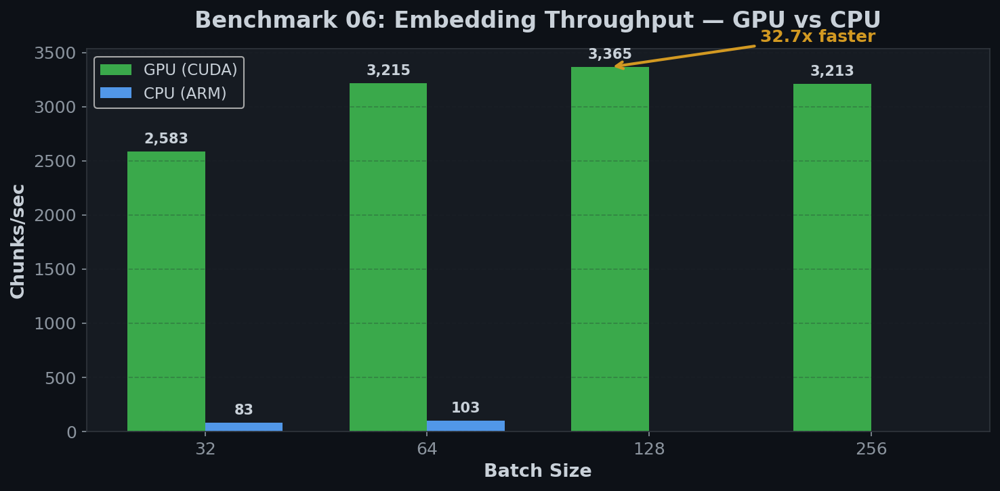
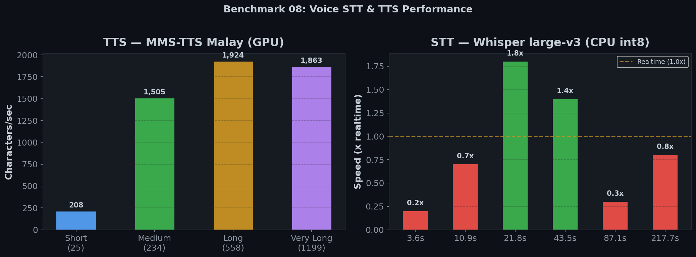

<div align="center">

# Gigabyte Grace Blackwell Desktop AI Benchmark Suite

### 8 AI Benchmarks on the NVIDIA Grace Blackwell Superchip

**Inference** · **Training** · **Efficiency** · **Voice**

---



<sub>Performance overview across all benchmarks (log scale)</sub>

</div>

---

## Hardware

```
Gigabyte Grace Blackwell Desktop AI (ATOM)
├── GPU:     NVIDIA GB10 (Blackwell, SM 12.1)
├── CPU:     20 ARM cores (Cortex-X925 + A725)
├── Memory:  128 GB LPDDR5X unified (CPU+GPU via NVLink-C2C)
├── Storage: 3.7 TB NVMe
├── CUDA:    13.0  ·  Driver: 580.142
└── OS:      Ubuntu 24.04 aarch64
```

> The GB10's **unified memory architecture** means CPU and GPU share the same 128 GB pool via NVLink-C2C. This allows running 72B parameter models and full fine-tuning of 7B models — workloads that are impossible on most desktop GPUs.

---

## Results at a Glance

| # | Benchmark | Highlight | |
|:-:|-----------|-----------|---|
| 01 | **Model Scaling** | 40.7 tok/s (8B) to 4.3 tok/s (72B) — all run | [Details](#01--inference-model-scaling) |
| 02 | **Engine Comparison** | Ollama 43.9 tok/s vs llama.cpp 42.6 · vLLM FAILED | [Details](#02--inference-engine-comparison) |
| 03 | **llama.cpp Multi-Quant** | 3,334 tok/s prompt processing (7B Q4) | [Details](#03--inference-llamacpp-multi-quantization) |
| 04 | **Fine-Tuning** | Full FT of Qwen2.5 7B using 90.9 GB | [Details](#04--training-fine-tuning) |
| 05 | **Token per Watt** | 0.88 tok/W peak · RM 0.17 per 1M tokens | [Details](#05--efficiency-token-per-watt) |
| 06 | **Embedding Throughput** | 3,365 chunks/s GPU · 33x faster than CPU | [Details](#06--inference-embedding-throughput) |
| 07 | **Image & Video Gen** | SKIPPED (no ComfyUI models installed) | [Details](#07--image--video-generation) |
| 08 | **Voice STT & TTS** | TTS: 1,924 chars/s · STT: 1.8x realtime | [Details](#08--voice-stt--tts) |

---

## 01 — Inference: Model Scaling

> Every available model tested via Ollama. **The 72B model runs** — most desktop GPUs cannot even load it.

<div align="center">

</div>

| Model | Size | tok/s | TTFT | GPU |
|-------|-----:|------:|-----:|----:|
| Qwen3 | 8B | **40.7** | 94ms | 65C |
| Qwen3.5 | 9B | **34.6** | 54ms | 70C |
| DeepSeek-Coder-V2 | 16B | FAIL | -- | 56C |
| Devstral | 14B | 13.8 | 115ms | 69C |
| Mistral-Small3.2 | 15B | 13.8 | 105ms | 72C |
| Qwen2.5-Coder | 32B | 10.0 | 134ms | 74C |
| Qwen2.5 | 72B | 4.3 | 314ms | 74C |

<sub>DeepSeek-Coder-V2 16B failed to generate tokens (timed out). All other models ran successfully.</sub>

<details>
<summary>Raw data</summary>

See [`01-inference-model-scaling/results/model-scaling-results.csv`](01-inference-model-scaling/results/model-scaling-results.csv)
</details>

---

## 02 — Inference: Engine Comparison

> Same model (Qwen2.5-7B), three engines. **Ollama wins.** vLLM failed to start — the stock NVIDIA container does not support SM 12.1.

<div align="center">

</div>

| Engine | Runtime | tok/s | GPU |
|--------|---------|------:|----:|
| **Ollama** | Native systemd | **43.9** | 61-65C |
| **llama.cpp** | Native binary | **42.6** | 64C |
| **vLLM** | Docker container | FAILED | -- |

llama.cpp prompt processing: **3,334 tok/s** (PP512).

> vLLM failed because `nvcr.io/nvidia/vllm:26.01-py3` does not include CUDA kernels for the GB10's SM 12.1 architecture. No community-compiled image was available for this test.

<details>
<summary>Raw data</summary>

See [`02-inference-engine-comparison/results/engine-comparison-results.csv`](02-inference-engine-comparison/results/engine-comparison-results.csv)
</details>

---

## 03 — Inference: llama.cpp Multi-Quantization

> Q4_K_M quantization across 4 model sizes (extracted from Ollama blobs). All models fit in memory.

<div align="center">

</div>

| Model | Quant | PP 128 | PP 256 | PP 512 | TG 128 |
|-------|-------|-------:|-------:|-------:|-------:|
| **Qwen2.5-7B** | Q4_K_M | 2,557 | 3,224 | **3,334** | **42.6** |
| **Qwen3-8B** | Q4_K_M | 2,577 | 2,954 | 3,018 | 38.3 |
| **Qwen2.5-32B** | Q4_K_M | 683 | **723** | 716 | 9.6 |
| **Qwen2.5-72B** | Q4_K_M | 306 | **314** | 305 | 4.0 |

<sub>All benchmarks run with Flash Attention enabled, all layers on GPU (ngl=99), 3 repetitions averaged.</sub>

<details>
<summary>Raw data</summary>

See [`03-inference-llama-cpp/results/benchmark_20260413_120412.csv`](03-inference-llama-cpp/results/benchmark_20260413_120412.csv) for all PP128/PP256/PP512/TG128 measurements.
</details>

---

## 04 — Training: Fine-Tuning

> Three fine-tuning methods compared on **Qwen2.5-7B-Instruct**, same dataset (Dolly 15k), same hyperparameters (dry-run, 5 steps). Full Fine-Tune uses **90.9 GB of 128 GB unified memory** — only possible because of the GB10's shared CPU+GPU memory pool.

<div align="center">

<br><sub>QLoRA uses 7x less memory than Full FT. LoRA achieves the highest throughput.</sub>
</div>

| Mode | Time | Peak Memory | tok/s | Final Loss |
|------|-----:|------------:|------:|-----------:|
| **LoRA** | 2m 25s | 83.3 GB | **156** | 1.83 |
| **Full FT** | 2m 44s | 90.9 GB | 137 | **1.57** |
| **QLoRA** | 4m 59s | **12.8 GB** | 75 | 1.88 |

<details>
<summary>Run details</summary>

See [`04-training-finetuning/results/all_runs_summary.csv`](04-training-finetuning/results/all_runs_summary.csv) for full metrics.
</details>

---

## 05 — Efficiency: Token per Watt

> How much does it cost to run inference? Measured with real-time GPU power monitoring during generation.

<div align="center">

</div>

| Model | tok/s | Avg Power | tok/W | Cost per 1M tokens |
|-------|------:|----------:|------:|--------------------:|
| **Qwen2.5-7B** | 39.1 | 44.6W | **0.879** | RM 0.17 |
| **Qwen3-8B** | 36.3 | 48.5W | 0.748 | RM 0.21 |
| **Qwen2.5-Coder-32B** | 9.1 | 47.7W | 0.191 | RM 0.80 |
| **Qwen2.5-72B** | 3.9 | 36.8W | 0.105 | RM 1.46 |

<sub>Electricity cost based on Malaysian tariff (RM 0.55/kWh). Running 1 million tokens on the most efficient config costs about RM 0.17.</sub>

---

## 06 — Inference: Embedding Throughput

> Mesolitica Mistral 191M embedding model — **GPU is 33x faster than CPU**.

<div align="center">

</div>

| Device | Batch Size | Chunks/s | Power |
|--------|----------:|---------:|------:|
| CPU | 64 | 103 | 14W |
| **GPU** | 32 | 2,620 | 49W |
| **GPU** | 128 | **3,365** | 58W |
| **GPU** | 256 | 3,252 | 59W |

> Batch 128 is the sweet spot — beyond that, throughput plateaus while power increases.

<details>
<summary>Full results with 5000-chunk tests</summary>

| Device | Chunks | Batch | Chunks/s |
|--------|-------:|------:|---------:|
| GPU | 5000 | 32 | 2,620 |
| GPU | 5000 | 64 | 3,279 |
| GPU | 5000 | 128 | **3,348** |
| GPU | 5000 | 256 | 3,252 |

See [`06-inference-embedding/results/embedding-throughput-summary.csv`](06-inference-embedding/results/embedding-throughput-summary.csv)
</details>

---

## 07 — Image & Video Generation

> **SKIPPED** — no ComfyUI models were installed on the ATOM machine at the time of benchmarking.

Scripts are included in `07-image-video-generation/` for future use. See the [GX10 benchmark results](https://github.com/pendakwahteknologi/gx10-benchmarks) for reference numbers on the same hardware platform.

---

## 08 — Voice: STT & TTS

> **MMS-TTS Malay** (text-to-speech, GPU) and **Whisper large-v3** (speech-to-text, CPU).

<div align="center">

</div>

### TTS — MMS-TTS Malay

facebook/mms-tts-zlm on GPU. Generates speech **up to 125x faster than realtime**.

| Text | Chars | Synthesis | Audio Output | Chars/s | RTF |
|------|------:|----------:|-------------:|--------:|----:|
| Short | 25 | 0.12s | 2.3s | 208 | 0.054 |
| Medium | 234 | 0.16s | 16.0s | 1,505 | 0.010 |
| Long | 558 | 0.29s | 37.0s | **1,924** | 0.008 |
| Very Long | 1,199 | 0.65s | 79.3s | 1,863 | **0.008** |

<sub>RTF = Real-Time Factor. RTF 0.008 means 1 second of audio is synthesized in 8 milliseconds.</sub>

> Audio samples: [`08-voice-stt-tts/samples/`](08-voice-stt-tts/samples/) — listen to the Malay speech output.

### STT — Whisper large-v3

faster-whisper with CTranslate2 on CPU (int8). Malay language, beam size 5.

| Audio | Transcribe Time | Speed | RTF |
|------:|----------------:|------:|----:|
| 3.6s | 16.1s | 0.2x | 4.44 |
| 10.9s | 14.7s | 0.7x | 1.35 |
| 21.8s | 12.0s | **1.8x** | 0.55 |
| 43.5s | 32.1s | **1.4x** | 0.74 |
| 87.1s | 345.9s | 0.3x | 3.97 |
| 217.7s | 274.9s | 0.8x | 1.26 |

<sub>CTranslate2 on aarch64 lacks CUDA wheels, so Whisper runs on CPU. GPU inference would be significantly faster. The 87.1s test shows degraded performance likely due to memory pressure at scale.</sub>

---

## Repository Structure

```
aitopatom-benchmarks/
├── charts/                            Performance visualization charts
├── 01-inference-model-scaling/        Ollama · 7 models · 8B to 72B
├── 02-inference-engine-comparison/    Ollama vs llama.cpp vs vLLM (failed)
├── 03-inference-llama-cpp/            Q4_K_M · 7B to 72B
├── 04-training-finetuning/            LoRA · QLoRA · Full FT (dry run)
├── 05-efficiency-token-per-watt/      Power monitoring · cost analysis
├── 06-inference-embedding/            CPU vs GPU · batch size sweep
├── 07-image-video-generation/         Scripts only (benchmark skipped)
└── 08-voice-stt-tts/                  Whisper STT · MMS-TTS · audio samples
```

Each benchmark includes:
- **README.md** — methodology and configuration
- **run.sh / benchmark.py** — fully reproducible scripts
- **results/** — raw CSVs, JSON metadata, HTML reports, logs
- **samples/** — generated audio (benchmark 08)
- **charts/** — performance visualization charts

## Reproducibility

All benchmarks were run on the same ATOM hardware with no other GPU workloads active. To reproduce:

1. Set up the required software per each benchmark's README
2. Download the required models
3. Run `./run.sh` or `python3 benchmark.py`
4. Compare your results against the CSVs in `results/`

## License

MIT

---

<div align="center">
<sub>Pendakwah Teknologi · April 2026 · All benchmarks run on Gigabyte Grace Blackwell Desktop AI (GB10)</sub>
</div>
