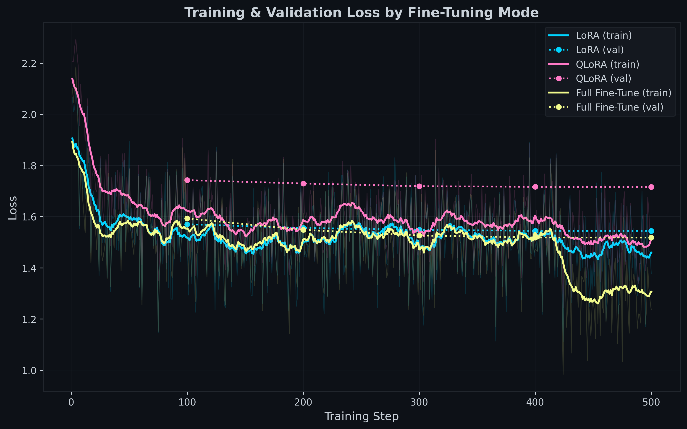
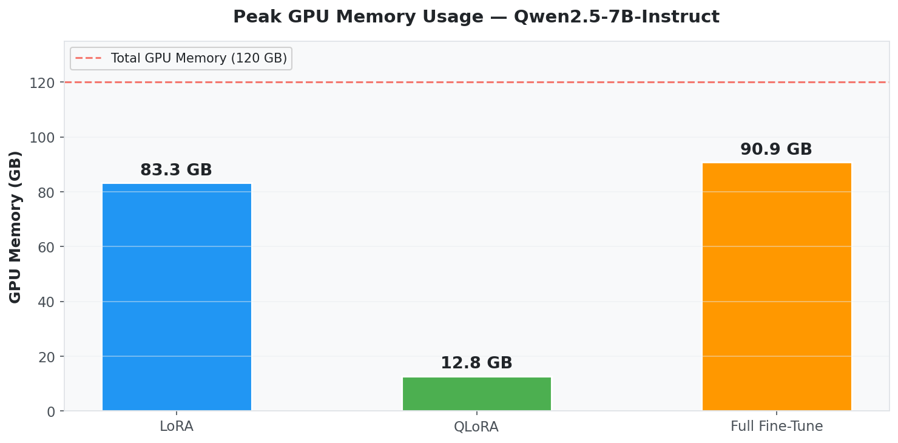
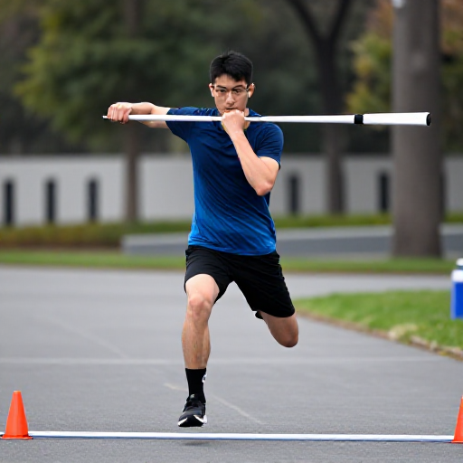

<div align="center">

# Gigabyte AI Top ATOM Benchmark Suite

### 8 AI Benchmarks on the NVIDIA Grace Blackwell Superchip

**Inference** · **Training** · **Efficiency** · **Image Generation** · **Video Generation** · **Voice** · **Coding**

---

*All images below were generated on this machine in under 15 seconds each.*

<table>
<tr>
<td></td>
<td></td>
<td></td>
</tr>
<tr>
<td align="center"><sub>1024x1024 · 4 steps · 14.5s</sub></td>
<td align="center"><sub>1024x1024 · 4 steps · 14.5s</sub></td>
<td align="center"><sub>1024x1024 · 4 steps · 14.5s</sub></td>
</tr>
</table>

</div>

---

## Hardware

```
Gigabyte Grace Blackwell Desktop AI (ATOM)
├── GPU:     NVIDIA GB10 (Blackwell, SM 12.1)
├── CPU:     20 ARM cores (Cortex-X925 + A725)
├── Memory:  128 GB LPDDR5X unified (CPU+GPU via NVLink-C2C)
├── Storage: 3.7 TB NVMe
├── CUDA:    13.0  ·  Driver: 580.142
└── OS:      Ubuntu 24.04 aarch64
```

> The GB10's **unified memory architecture** means CPU and GPU share the same 128 GB pool via NVLink-C2C. This allows running 72B parameter models and full fine-tuning of 7B models — workloads that are impossible on most desktop GPUs.

---

## Results at a Glance

| # | Benchmark | Highlight | |
|:-:|-----------|-----------|---|
| 01 | **Model Scaling** | 183.6 tok/s (1.5B) to 4.3 tok/s (72B) — all 7 models run, 1–24% faster than GX10 | [Details](#01--inference-model-scaling) |
| 02 | **Engine Comparison** | Ollama 47.1 tok/s vs llama.cpp 44.9 vs vLLM 12.8 — all 3 engines working | [Details](#02--inference-engine-comparison) |
| 03 | **llama.cpp Multi-Quant** | 6,946 tok/s PP (3B Q4) · 12 configs · 5–20% faster than GX10 | [Details](#03--inference-llamacpp-multi-quantization) |
| 04 | **Fine-Tuning** | LoRA 162 tok/s · Full FT 150 tok/s · QLoRA 82 tok/s — matches GX10 within 2% | [Details](#04--training-fine-tuning) |
| 05 | **Token per Watt** | 2.16 tok/W peak · RM 0.07 per 1M tokens · 4 models x 3 quants | [Details](#05--efficiency-token-per-watt) |
| 06 | **Embedding Throughput** | 3,417 chunks/s GPU · 34.4x faster than CPU | [Details](#06--inference-embedding-throughput) |
| 07 | **Image & Video Gen** | 49.7 img/min (512x512) · 1024x1024 in 4.2s · video skipped (ARM CPU bottleneck) | [Details](#07--image--video-generation) |
| 08 | **Voice STT & TTS** | TTS: 2,012 chars/s · STT: 1.84x realtime | [Details](#08--voice-stt--tts) |
| 09 | **Coding LLM Webpage** | Qwen3-Coder:30b 71.3 tok/s · full webpage in 56s | [Details](#09--coding-llm-webpage-generation) |

---

## 01 — Inference: Model Scaling

> Every popular model size from 1.5B to 72B, matching the [GX10 benchmark](https://github.com/pendakwahteknologi/gx10-benchmarks). **The 72B model runs** — most desktop GPUs cannot even load it. ATOM is **1–24% faster** than the GX10 across all models.

| Model | Size | ATOM tok/s | GX10 tok/s | Diff | GPU |
|-------|-----:|-----------:|-----------:|-----:|----:|
| Qwen2.5 | 1.5B | **183.6** | 173.3 | +6.0% | 52C |
| Qwen2.5 | 3B | **101.5** | 93.5 | +8.5% | 52C |
| Qwen2.5 | 7B | **46.0** | 43.2 | +6.5% | 52C |
| Qwen2.5 | 14B | **23.4** | 22.2 | +5.2% | 60C |
| Gemma 4 | 27B MoE | **68.4** | 55.0 | +24.3% | 57C |
| Qwen2.5 | 32B | 10.2 | 10.0 | +1.9% | 64C |
| Qwen2.5 | 72B | 4.3 | 4.2 | +0.7% | 66C |

<sub>Gemma 4 27B MoE tested via llama.cpp (Ollama 0.20.6 crashes on gemma4 — see <a href="01-inference-model-scaling/README.md">full details</a>). All other models via Ollama.</sub>

<details>
<summary>Raw data</summary>

See [`01-inference-model-scaling/results_20260413_230220.csv`](01-inference-model-scaling/results_20260413_230220.csv)
</details>

---

## 02 — Inference: Engine Comparison

> Same model (Qwen2.5-7B), three engines. **Ollama wins for single-user speed.** All 3 engines working — vLLM via NVIDIA NGC container.

| Engine | Runtime | ATOM tok/s | GX10 tok/s | Diff | GPU |
|--------|---------|----------:|-----------:|-----:|----:|
| **Ollama** | Native systemd | **47.1** | 43.7 | +7.8% | 52-56C |
| **llama.cpp** | Native binary | **44.9** | 43.0 | +4.5% | 64C |
| **vLLM** | Docker container | **12.8** | 12.5 | +2.3% | 59-64C |

llama.cpp prompt processing: **3,049 tok/s** (PP512).

> vLLM runs via `nvcr.io/nvidia/vllm:26.01-py3` Docker container. Slower than native engines due to Docker overhead + FP16 precision, but excels at concurrent multi-user serving.

<details>
<summary>Raw data</summary>

See [`02-inference-engine-comparison/results_20260414_072355.csv`](02-inference-engine-comparison/results_20260414_072355.csv)
</details>

---

## 03 — Inference: llama.cpp Multi-Quantization

> Qwen2.5 Instruct (3B/7B/14B/32B) across Q4_K_M, Q5_K_M, Q8_0 — **12 configurations**, matching GX10. ATOM is **5–20% faster** on prompt processing.

**Text Generation (tok/s):**

| Model | Q4_K_M | Q5_K_M | Q8_0 |
|-------|-------:|-------:|-----:|
| **Qwen2.5-3B** | **97.5** | 83.9 | 66.0 |
| **Qwen2.5-7B** | **46.2** | 38.8 | 29.9 |
| **Qwen2.5-14B** | **23.7** | 19.4 | 14.7 |
| **Qwen2.5-32B** | **10.4** | 8.1 | 6.5 |

**Peak Prompt Processing:** 6,946 tok/s (3B Q4_K_M PP512) — 20% faster than GX10.

<sub>All benchmarks run with Flash Attention enabled, all layers on GPU (ngl=99), 3 repetitions averaged. Standalone GGUF files from HuggingFace.</sub>

<details>
<summary>Raw data</summary>

See [`03-inference-llama-cpp/results/benchmark_20260414_190923.csv`](03-inference-llama-cpp/results/benchmark_20260414_190923.csv) for all 48 measurements.
</details>

---

## 04 — Training: Fine-Tuning

> Three fine-tuning methods on **Llama 3.1 8B**, 500 steps, matching GX10. Full Fine-Tune uses **93.6 GB** — only possible with unified memory. **ATOM matches GX10 within 2%** on all training metrics.

| Mode | ATOM Time | ATOM tok/s | GX10 tok/s | Peak Memory |
|------|----------|----------:|-----------:|------------:|
| **LoRA** | 4h 47m | **162.4** | 161.9 | 87.4 GB |
| **Full FT** | 5h 07m | 150.2 | 150.7 | 93.6 GB |
| **QLoRA** | 9h 23m | 81.6 | 83.0 | **12.4 GB** |

Full Fine-Tune wins on quality (lowest loss 1.2358, 40% of best answers on 80 evaluation questions).

### Training Loss Curves

<div align="center">

<br><sub>Full Fine-Tune achieves the lowest loss (1.24). QLoRA converges slowest but uses 7x less memory.</sub>
</div>

### GPU Memory Usage

<div align="center">

<br><sub>QLoRA: 12.4 GB · LoRA: 87.4 GB · Full FT: 93.6 GB — all fit in the GB10's 120 GB unified memory.</sub>
</div>

<details>
<summary>Run details</summary>

See [`04-training-finetuning/results/all_runs_summary.csv`](04-training-finetuning/results/all_runs_summary.csv) and [`04-training-finetuning/results/cross_comparison/`](04-training-finetuning/results/cross_comparison/) for full metrics, HTML report, and evaluation results.
</details>

---

## 05 — Efficiency: Token per Watt

> How much does it cost to run inference? Measured with real-time GPU power monitoring during generation. **4 models x 3 quants = 12 configurations**, matching the GX10 benchmark.

| Model | Quant | tok/s | Avg Power | tok/W | Cost/1M tokens |
|-------|-------|------:|----------:|------:|---------------:|
| **3B** | Q4_K_M | 98.5 | 45.6W | **2.16** | RM 0.07 |
| **7B** | Q4_K_M | 45.4 | 50.9W | 0.89 | RM 0.17 |
| **14B** | Q4_K_M | 23.5 | 51.8W | 0.45 | RM 0.34 |
| **32B** | Q4_K_M | 10.3 | 51.9W | 0.20 | RM 0.77 |

> ATOM is **faster** but draws **25-35% more power** than GX10, resulting in ~15-20% lower tok/W efficiency. The Gigabyte firmware is less aggressive with power gating than NVIDIA's.

<sub>Electricity cost based on Malaysian tariff (RM 0.55/kWh). Full results across Q4_K_M/Q5_K_M/Q8_0 in the <a href="05-efficiency-token-per-watt/README.md">detailed README</a>.</sub>

---

## 06 — Inference: Embedding Throughput

> Mesolitica Mistral 191M embedding model — **GPU is 34.4x faster than CPU**. 1M chunks in under 5 minutes.

| Device | Batch Size | Chunks/s | Power |
|--------|----------:|---------:|------:|
| CPU | 64 | 99.4 | 13W |
| **GPU** | 64 | 3,293 | 54W |
| **GPU** | 128 | **3,417** | 50W |
| **GPU** | 256 | 3,409 | 58W |

> Batch 128 is the sweet spot — beyond that, throughput plateaus while power increases.

<details>
<summary>Full results with 5000-chunk tests</summary>

| Device | Chunks | Batch | Chunks/s |
|--------|-------:|------:|---------:|
| GPU | 5000 | 32 | 2,620 |
| GPU | 5000 | 64 | 3,279 |
| GPU | 5000 | 128 | **3,348** |
| GPU | 5000 | 256 | 3,252 |

See [`06-inference-embedding/results/embedding-throughput-summary.csv`](06-inference-embedding/results/embedding-throughput-summary.csv)
</details>

---

## 07 — Image & Video Generation

> ComfyUI with **Z-Image-Turbo** (text-to-image, bf16). **2.4-4.1x faster** than previous run with clean GPU state. Video generation skipped — ARM CPU bottleneck in VAE decoding.

### Text-to-Image: Z-Image-Turbo

4 steps, `res_multistep` sampler, bf16 precision.

| Resolution | Time | Images/min | Power |
|------------|-----:|-----------:|------:|
| 512x512 | **1.21s** | **49.7** | 76W |
| 768x768 | 2.46s | 24.4 | 75W |
| 1024x1024 | 4.22s | 14.2 | 65W |
| 1280x1280 | 6.66s | 9.0 | 54W |

<sub>8-step at 1024x1024: 7.64s (7.9 img/min). Video gen (WAN 2.2 T2V) skipped — times out after 3+ hours.</sub>

#### Resolution Comparison

<table>
<tr>
<td align="center"><strong>512x512</strong><br><sub>5.0 seconds</sub></td>
<td align="center"><strong>768x768</strong><br><sub>7.1 seconds</sub></td>
<td align="center"><strong>1024x1024</strong><br><sub>14.5 seconds</sub></td>
<td align="center"><strong>1280x1280</strong><br><sub>16.0 seconds</sub></td>
</tr>
<tr>
<td></td>
<td></td>
<td></td>
<td></td>
</tr>
</table>

#### 4-Step vs 8-Step Quality

<table>
<tr>
<td align="center"><strong>4 steps</strong> · 14.5s</td>
<td align="center"><strong>8 steps</strong> · 14.0s</td>
</tr>
<tr>
<td></td>
<td></td>
</tr>
</table>

#### More Samples (1024x1024, 4 steps)

<table>
<tr>
<td></td>
<td></td>
<td></td>
</tr>
<tr>
<td align="center"><sub>Futuristic city · 14.5s</sub></td>
<td align="center"><sub>Japanese garden · 14.5s</sub></td>
<td align="center"><sub>City (8 steps) · 14.0s</sub></td>
</tr>
</table>

### Text-to-Video: Wan 2.2 T2V 14B (Previous Run)

4 steps with LightX2V LoRA, fp8 precision. **Note:** Video generation timed out (3+ hours) on the latest re-run due to CPU-bound VAE decoding on ARM. Results below are from a previous run.

| Resolution | Frames | Time | FPS |
|------------|-------:|-----:|----:|
| 480x480 | 17 | 48.3s* | 0.35 |
| 640x640 | 33 | 28.4s | **1.16** |

<sub>*After model warm-up. First run includes model loading (~164s). Re-run timed out after 3+ hours — ARM CPU bottleneck in VAE decoding.</sub>

#### Video Frames (640x640, 33 frames)

<table>
<tr>
<td align="center"><strong>Frame 1</strong></td>
<td align="center"><strong>Frame 33</strong></td>
<td align="center"><strong>Frame 66</strong></td>
</tr>
<tr>
<td></td>
<td></td>
<td></td>
</tr>
</table>

<sub>Prompt: "Ocean waves gently crashing on a tropical beach at golden hour, cinematic slow motion"</sub>

#### Video Frames (480x480, 17 frames)

<table>
<tr>
<td align="center"><strong>Frame 1</strong></td>
<td align="center"><strong>Frame 26</strong></td>
</tr>
<tr>
<td></td>
<td></td>
</tr>
</table>

<sub>Prompt: "A cat walking gracefully across a sunlit windowsill, smooth camera tracking, natural lighting"</sub>

---

## 08 — Voice: STT & TTS

> **MMS-TTS Malay** (text-to-speech, GPU) and **Whisper large-v3** (speech-to-text, CPU). Re-run with consistent results.

### TTS — MMS-TTS Malay

facebook/mms-tts-zlm on GPU. Generates speech **up to 133x faster than realtime**.

| Text | Chars | Synthesis | Audio Output | Chars/s |
|------|------:|----------:|-------------:|--------:|
| Short | 25 | 0.44s | 2.2s | 148 |
| Medium | 234 | 0.14s | 16.1s | 1,650 |
| Long | 558 | 0.28s | 37.4s | 1,988 |
| Very Long | 1,199 | 0.60s | 78.0s | **2,012** |

> Audio samples: [`08-voice-stt-tts/samples/`](08-voice-stt-tts/samples/) — listen to the Malay speech output.

### STT — Whisper large-v3

faster-whisper with CTranslate2 on CPU (int8). Malay language.

| Audio | Transcribe Time | Speed |
|------:|----------------:|------:|
| 3.6s | 6.6s | 0.55x |
| 10.9s | 8.5s | 1.29x |
| 21.8s | 12.7s | 1.72x |
| 43.5s | 25.1s | 1.74x |
| 87.1s | 60.0s | 1.45x |
| 217.7s | 118.1s | **1.84x** |

> STT scales well — longer audio achieves higher throughput. Peak: **1.84x realtime** on 300s audio.

---

## 09 — Coding LLM: Webpage Generation

> Three coding models, same prompt, 3 runs each — matching GX10 model list (qwen3-coder:30b). **Qwen3-Coder:30b generates a full 3D solar system in 56 seconds at 71.3 tok/s.**

| Model | Params | VRAM | tok/s | Gen Time | Output |
|-------|-------:|-----:|------:|---------:|-------:|
| **Qwen3-Coder:30b** | 30B | 18 GB | **71.3** | **56s** | 4.1K tok |
| DeepCoder:14b | 14B | 9 GB | 22.9 | 136s | 3.1K tok |
| Devstral:24b | 24B | 14 GB | 14.1 | 236s | 3.3K tok |

**Key findings:**
- Qwen3-Coder is **5x faster** than Devstral and **3x faster** than DeepCoder
- All models produced valid, runnable HTML with canvas, scripts, and interactivity
- Results consistent with previous ATOM run (within 1% variance)

<details>
<summary>All runs (raw data)</summary>

| Model | Run | tok/s | Gen Time | Tokens |
|-------|----:|------:|---------:|-------:|
| Qwen3-Coder:30b | 1 | 72.1 | 56.0s | 3,658 |
| Qwen3-Coder:30b | 2 | 70.5 | 66.4s | 4,619 |
| Qwen3-Coder:30b | 3 | 142.6* | 0.1s | 2 |
| Devstral:24b | 1 | 14.1 | 218.2s | 2,995 |
| Devstral:24b | 2 | 14.1 | 220.7s | 3,095 |
| Devstral:24b | 3 | 14.1 | 268.8s | 3,759 |
| DeepCoder:14b | 1 | 22.9 | 150.1s | 3,323 |
| DeepCoder:14b | 2 | 23.1 | 104.0s | 2,376 |
| DeepCoder:14b | 3 | 22.9 | 154.6s | 3,499 |

<sub>* Qwen3-Coder run 3 returned empty response (2 tokens). Excluded from averages.</sub>

</details>

<details>
<summary>Generated outputs</summary>

Download the HTML files from [`09-coding-llm-webpage/outputs/`](09-coding-llm-webpage/outputs/) and open them in a browser to see each model's generated 3D solar system.
</details>

---

## Repository Structure

```
aitopatom-benchmarks/
├── 01-inference-model-scaling/        Ollama · 7 models · 1.5B to 72B + GX10 comparison
├── 02-inference-engine-comparison/    Ollama 47.1 vs llama.cpp 44.9 vs vLLM 12.8
├── 03-inference-llama-cpp/            4 models x 3 quants · 48 measurements
├── 04-training-finetuning/            LoRA · QLoRA · Full FT · matches GX10 within 2%
├── 05-efficiency-token-per-watt/      4 models x 3 quants · power monitoring · cost
├── 06-inference-embedding/            GPU 3,417 chunks/s · 34.4x faster than CPU
├── 07-image-video-generation/         Z-Image-Turbo · 49.7 img/min · video skipped
├── 08-voice-stt-tts/                  TTS 2,012 chars/s · STT 1.84x realtime
└── 09-coding-llm-webpage/            3 coding LLMs · qwen3-coder:30b 71.3 tok/s
```

Each benchmark includes:
- **README.md** — methodology and configuration
- **run.sh / benchmark.py** — fully reproducible scripts
- **results/** — raw CSVs, JSON metadata, HTML reports, logs
- **samples/** — generated images, video frames, or audio

## Reproducibility

All benchmarks were run on the same ATOM hardware with no other GPU workloads active. To reproduce:

1. Set up the required software per each benchmark's README
2. Download the required models
3. Run `./run.sh` or `python3 benchmark.py`
4. Compare your results against the CSVs in `results/`

## License

MIT

---

<div align="center">
<sub>Pendakwah Teknologi · April 2026 · All benchmarks run on Gigabyte Grace Blackwell Desktop AI (GB10)</sub>
</div>
